# 前言

## 学习目标

1. 理解使用会话技术的原因
2. 理解客户端技术和服务器技术之间的区别
3. 掌握Cookie的设置（构造），熟悉Cookie的获取，能够通过浏览器查看Cookie信息
4. 理解Session维护的机制，能够分析Session的失效原因
5. 熟悉使用Session存储和获取信息
6. 掌握Cookie和Session的使用场景

## 前置知识准备

- 响应头的设置
- Postman中设置请求头
- URL编码(浏览器地址栏不能写中文或一些特殊的字符)

# 会话技术Conversation

同一个客户端向服务器中发送的多个请求，需要信息共享

在做服务器开发过程中，我们的客户端和服务器之间，会有请求报文和响应报文

客户端给服务器发送请求：请求报文

服务器给客户端发送响应：响应报文


HTTP协议的无状态性，会导致一个问题，服务器不清楚究竟是哪一个客户端


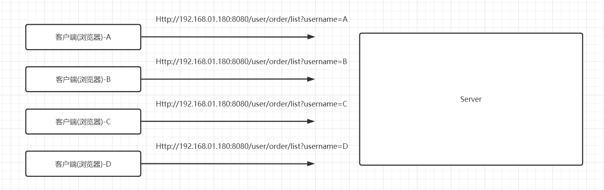

通过这种方式，携带了一些信息，服务器确实是可以知道 请求来自于哪一个客户端？


通过上面这种方式，是否有弊端？

- 用户信息不安全
- 客户端和浏览器每一次发送请求的时候都需要携带请求参数比较繁琐

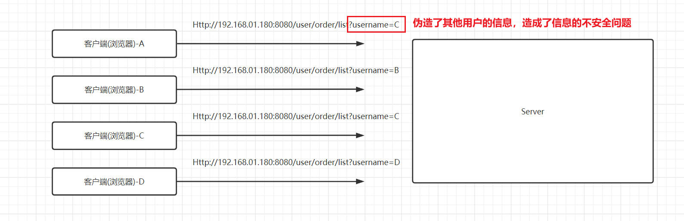

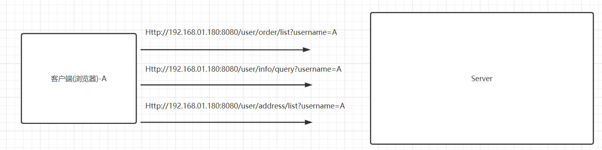


以会话的形式来体现客户端和服务器之间的交流，**最重要的一件事情是要让服务器知道客户端是谁**。


> 李雷（客户端）：韩梅梅你好，我想请你吃饭
>
> 韩梅梅（服务器）：（韩梅梅不知道你是谁）你是谁呀？
>
> 李雷（客户端）：韩梅梅你好，我是李雷，我想请你吃饭
>
> 韩梅梅（服务器）：可以啊，在哪里吃饭呢
>
> 李雷（客户端）：我们去吃香他她煲仔饭吧
>
> 韩梅梅（服务器）：你是谁，我是和谁去吃煲仔饭
>
> 李雷（客户端）：吃完饭去看电影吧
>
> 韩梅梅（服务器）：你是谁，我是和谁去看电影


如果没有会话技术，服务器不清楚每一次请求来源于哪一个客户端

如果引入会话技术，这段会话就会变成这个样子

> 李雷（客户端）：韩梅梅你好，我是李雷，我想请你吃饭
>
> 韩梅梅（服务器）：好啊，那吃什么
>
> 李雷（客户端）：我们去吃香他她香他她煲仔饭吧
>
> 韩梅梅（服务器）：好啊，那说好了，李雷咱两去吃煲仔饭，几点见面
>
> 李雷（客户端）：晚上6点可以吗
>
> 韩梅梅（服务器）：可以啊，那吃完饭呢
>
> 李雷（客户端）：吃完饭去看电影吧
>
> 韩梅梅（服务器）：好吧


如果做到的这件事情呢？

一种情况是，我直接告知你我的信息

> 李雷（客户端）：韩梅梅你好，我是李雷，我想请你吃饭
>
> 韩梅梅（服务器）：好啊，那吃什么 (我给你提醒，你要告诉我你是李雷)
>
> 李雷（客户端）：我们去吃香他她香他她煲仔饭吧 （我是李雷）
>
> 韩梅梅（服务器）：好啊，那说好了，李雷咱两去吃煲仔饭，几点见面
>
> 李雷（客户端）：晚上6点可以吗（我是李雷）
>
> 韩梅梅（服务器）：可以啊，那吃完饭呢
>
> 李雷（客户端）：吃完饭去看电影吧（我是李雷）
>
> 韩梅梅（服务器）：好吧

还有种情况，类似于你服务器端有个保险柜，告知我你的保险柜的编号，就可以获得保险柜，然后从保险柜中获得信息

> 李雷（客户端）：韩梅梅你好，我是李雷，我想请你吃饭
>
> 韩梅梅（服务器）：好啊，那吃什么 (我给你一个编号，这个编号是89757)
>
> 李雷（客户端）：我们去吃香他她香他她煲仔饭吧 （编号89757）
>
> 韩梅梅（服务器）：好啊，那说好了，李雷咱两去吃煲仔饭，几点见面
>
> 李雷（客户端）：晚上6点可以吗（编号89757）
>
> 韩梅梅（服务器）：可以啊，那吃完饭呢
>
> 李雷（客户端）：吃完饭去看电影吧（编号89757）
>
> 韩梅梅（服务器）：好吧

如果是客户端直接携带确切的信息，这个就是客户端技术；如果是通过客户端提供的编号，进而在服务器中进一步获得信息，那么这个就是服务器技术

服务器会话技术，是在客户端会话技术基础上的


归根结底：（身份）信息，究竟是客户端维护的，还是服务器维护的


客户端技术：Cookie

服务器技术：Session


# 客户端技术Cookie

携带信息：客户端（浏览器）在向服务器发起请求的时候直接携带了信息，这些信息是通过请求头中一个特殊的请求头携带的

这个特殊的请求头叫Cookie

## Cookie的格式

Cookie：key1=value1;key2=value2

携带的是键值对信息，携带的键值对信息都是字符串信息

可以携带多组键值对信息，如果携带多组，中间使用分号分隔开

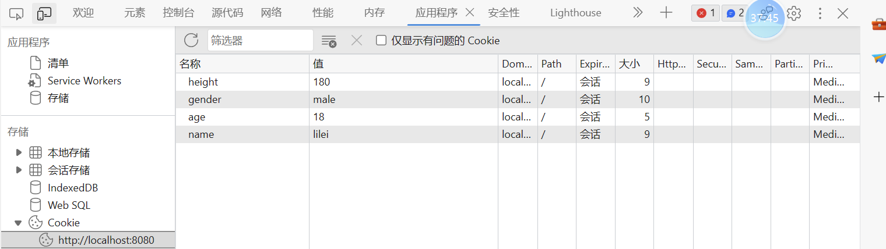


```http
GET http://localhost:8080/ HTTP/1.1
Host: localhost:8080
Connection: keep-alive
Cache-Control: max-age=0
sec-ch-ua: "Chromium";v="116", "Not)A;Brand";v="24", "Microsoft Edge";v="116"
sec-ch-ua-mobile: ?0
sec-ch-ua-platform: "Windows"
Upgrade-Insecure-Requests: 1
User-Agent: Mozilla/5.0 (Windows NT 10.0; Win64; x64) AppleWebKit/537.36 (KHTML, like Gecko) Chrome/116.0.0.0 Safari/537.36 Edg/116.0.1938.62
Accept: text/html,application/xhtml+xml,application/xml;q=0.9,image/webp,image/apng,*/*;q=0.8,application/signed-exchange;v=b3;q=0.7
Sec-Fetch-Site: none
Sec-Fetch-Mode: navigate
Sec-Fetch-User: ?1
Sec-Fetch-Dest: document
Accept-Encoding: gzip, deflate, br
Accept-Language: zh-CN,zh;q=0.9,en;q=0.8,en-GB;q=0.7,en-US;q=0.6
Cookie: name=lilei; age=18; gender=male; height=180

```


## 构造Cookie信息

这个过程是指，客户端（浏览器）在发起这个请求的时候，通过请求报文封装信息，请求报文中的请求头Cookie包含了对应的值

那么这里我们要构造Cookie信息，想办法让请求头Cookie里面包含对应的值

- 浏览器构造Cookie
- Postman构造Cookie
- 服务器构造Cookie

### 浏览器构造Cookie

步骤

> 1. 打开开发者工具，快捷键F12
> 2. 找应用程序（Application）
> 3. 应用程序里找 存储（Storage）里的Cookie

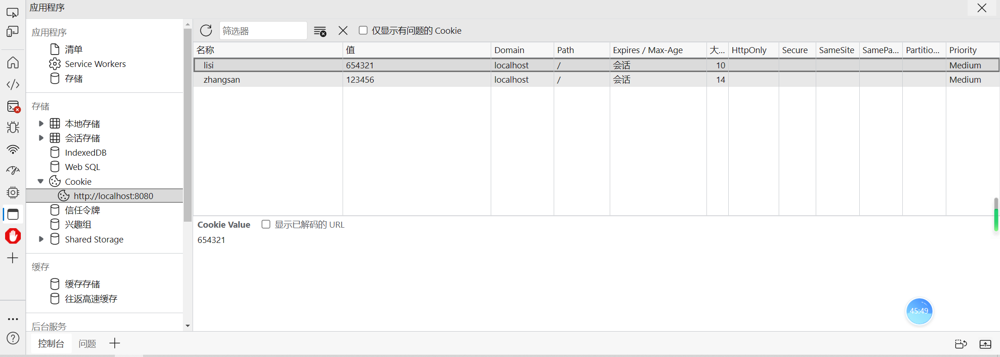

请求报文：

```http
GET http://localhost:8080/demo1/cookie/fetch HTTP/1.1
Host: localhost:8080
Connection: keep-alive
Cache-Control: max-age=0
sec-ch-ua: "Chromium";v="110", "Not A(Brand";v="24", "Microsoft Edge";v="110"
sec-ch-ua-mobile: ?0
sec-ch-ua-platform: "Windows"
Upgrade-Insecure-Requests: 1
User-Agent: Mozilla/5.0 (Windows NT 10.0; Win64; x64) AppleWebKit/537.36 (KHTML, like Gecko) Chrome/110.0.0.0 Safari/537.36 Edg/110.0.1587.46
Accept: text/html,application/xhtml+xml,application/xml;q=0.9,image/webp,image/apng,*/*;q=0.8,application/signed-exchange;v=b3;q=0.7
Sec-Fetch-Site: none
Sec-Fetch-Mode: navigate
Sec-Fetch-User: ?1
Sec-Fetch-Dest: document
Accept-Encoding: gzip, deflate, br
Accept-Language: zh-CN,zh;q=0.9,en;q=0.8,en-GB;q=0.7,en-US;q=0.6
Cookie: zhangsan=123456; lisi=654321

```

第17行里的值

> Cookie: zhangsan=123456; lisi=654321


### Postman构造Cookie

也是构造Cookie这个请求头

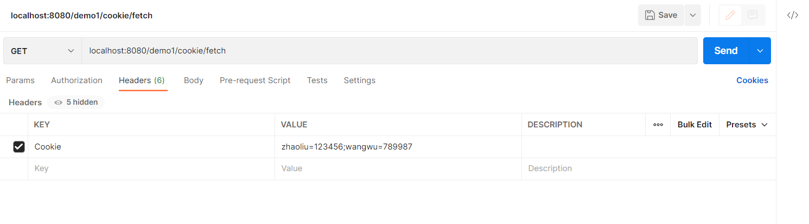

请求报文

```http
GET http://localhost:8080/demo1/cookie/fetch HTTP/1.1
Cookie: zhaoliu=123456;wangwu=789987
User-Agent: PostmanRuntime/7.29.2
Accept: */*
Host: localhost:8080
Accept-Encoding: gzip, deflate, br
Connection: keep-alive

```

第2行

> Cookie: zhaoliu=123456;wangwu=789987


### 服务器构造Cookie

客户端 → 服务器，请求

服务器 → 客户端，响应

客户端 → 服务器，请求


服务器能给客户端做的是响应

而我们希望的是客户端请求的时候携带Cookie


服务器提供特殊的响应报文，客户端获得这个特殊的请求报文之后，就会设置Cookie，在发送请求的时候就会携带Cookie了


特殊的响应报文，使用的是特殊的响应头，这个特殊的响应头set-cookie

```java
/**
 * 发送请求
 * http://localhost:8080/demo1/cookie/set?username=lilei
 * @author stone
 * @date 2023/02/17 16:13
 */
@WebServlet("/cookie/set")
public class CookieSetServlet extends HttpServlet {

    @Override
    protected void doGet(HttpServletRequest req, HttpServletResponse resp) throws ServletException, IOException {
        String username = req.getParameter("username");

        // 把这个通过响应报文给到浏览器，并且让浏览器发起请求的时候，通过Cookie来携带
        resp.setHeader("set-cookie","username=" + username);

    }
}
```

来看一下这个请求的响应报文

```http
HTTP/1.1 200
set-cookie: username=lilei
Content-Length: 0
Date: Fri, 17 Feb 2023 08:15:48 GMT
Keep-Alive: timeout=20
Connection: keep-alive

```

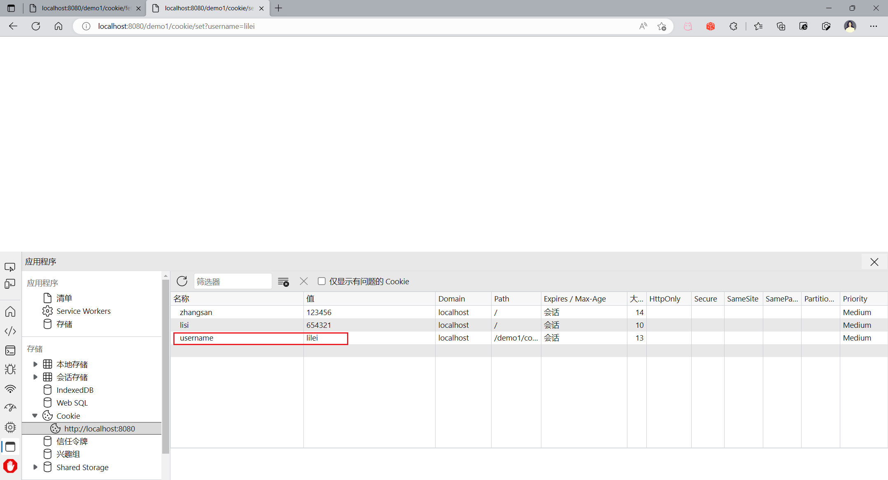


Response是针对于Cookie有提供特定的方法，能够让我们直接设置Cookie

> resp.addCookie(new Cookie("username",username));


## 获取Cookie

要获得的是Cookie这个请求头

> String result = request.getHeader("Cookie");
>
> 去解析里面的键值对

实际上我们并没有这样做，Request中提供了直接获得Cookie的方法

> Cookie[] cookies = request.getCookies();

单个Cookie，我们先获得其键值对信息

> 键：cookie.getName()
>
> 值：cookie.getValue()

```java
@WebServlet("/cookie/fetch")
public class CookieServlet extends HttpServlet {

    @Override
    protected void doGet(HttpServletRequest request, HttpServletResponse resp) throws ServletException, IOException {
        Cookie[] cookies = request.getCookies();
        for (Cookie cookie : cookies) {
            String name = cookie.getName();
            String value = cookie.getValue();
            System.out.println(name + " -> " + value);
        }
    }
}
```


## Cookie中的信息

Cookie这个类的实例中封装信息

| 信息   | 方法              | 说明                                                   |
| ------ | ----------------- | ------------------------------------------------------ |
| name   | 有参构造方法      | 核心值                                                 |
| value  | 有参构造方法      | 核心值                                                 |
| Path   | setPath(String)   | 设置Cookie的有效URI                                    |
| Domain | setDomain(String) | 域名，做Cookie的共享                                   |
| MaxAge | setMaxAge(int)    | 设置过期时间，单位是秒，如果超过这个时间Cookie就会过期 |

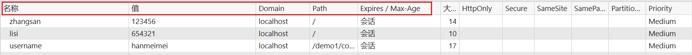

### Path

> cookie.setPath(String path)

如果没有手动setPath，cookie会给你设置一个默认的path，这个默认的path就是你当前这个请求的path

举个例子，比如http://localhost:8080/demo1/cookie/fetch,当前这个请求的path其实就是/demo1/cookie


验证一下，我们构造一个新的请求http://localhost:8080/demo1/cookie/path1

```java
@WebServlet("/cookie/path1")
public class PathServlet1 extends HttpServlet {
    @Override
    protected void doGet(HttpServletRequest req, HttpServletResponse resp) throws ServletException, IOException {
        resp.addCookie(new Cookie("username","zhangsan"));
    }
}
```

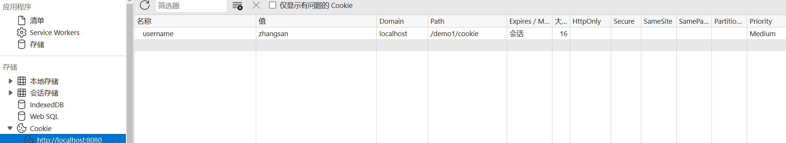


设置了path有什么用，访问该path对应的请求的时候才会获得（携带）该cookie

针对于上面的请求，也就是接下来要访问的url应该是这样的

`http://localhost:8080/demo1/cookie/*`


我们也可以自己指定path

```java
@WebServlet("/cookie/path2")
public class PathServlet2 extends HttpServlet {
    @Override
    protected void doGet(HttpServletRequest req, HttpServletResponse resp) throws ServletException, IOException {
        Cookie cookie = new Cookie("username", "zhangsan");
        cookie.setPath("/demo1");
        resp.addCookie(cookie);
    }
}
```


可以做到应用之间的数据共享

举个例子：比如在demo1中构造一个Cookie，在demo2中获得demo1中的Cookie的值不就是数据共享了么

http://localhost:8080/demo1/cookie/path3    设置Cookie的path为 `/demo2`或`/`，demo2中是可以获得这个cookie的

### Domain

设置域名或ip，用来说不同域名下Cookie共享


如果设置了Cookie的父域名，子域名下的请求可以共享父域名下的Cookie

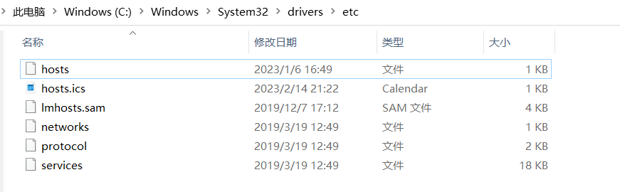

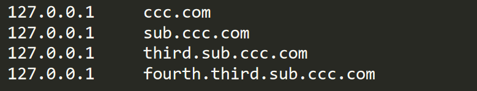

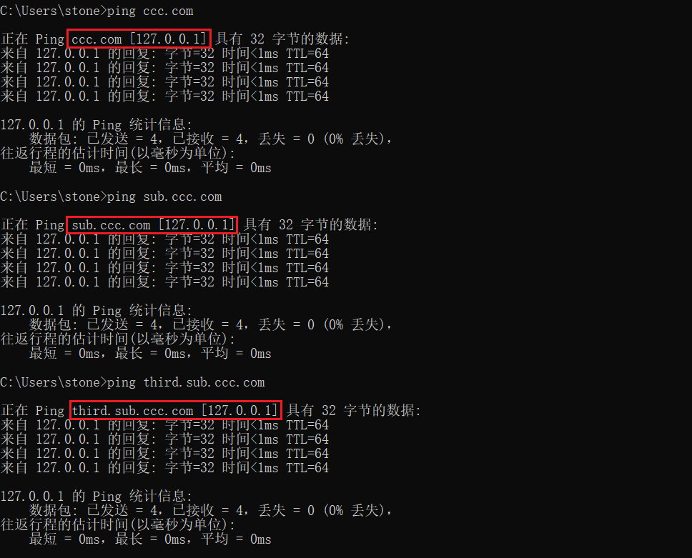


发送请求到我这台服务器

> 4. ccc.com:8080/demo1/cookie/fetch
> 5. sub.ccc.com:8080/demo1/cookie/fetch
> 6. third.sub.ccc.com:8080/demo1/cookie/fetch
> 7. fourth.third.sub.ccc.com:8080/demo1/cookie/fetch


先来做domain的设置

```java
// 需要访问的ccc.com:8080/domain
@WebServlet("/domain")
public class DomainServlet extends HttpServlet {

    @Override
    protected void doGet(HttpServletRequest req, HttpServletResponse resp) throws ServletException, IOException {
        Cookie cookie = new Cookie("jd", "liuqiangdong");
        // 打算以ccc.com作为父域名
        // 后面发送请求 ccc.com:8080/demo1/cookie/fetch
        cookie.setDomain("ccc.com");

        resp.addCookie(cookie);
    }
}
```


**注意**：不能设置和当前域名无关的domain，比如访问localhost时候设置一个ccc.com这样的domain是不可以的，否则浏览器会直接无视


### MaxAge

如果没有设置，则默认情况下存在于浏览器的内存中。**关闭浏览器，则cookie信息失效**。如果希望

cookie可以持久化保存，则可以设置一个maxAge=正数的时间，表示会在硬盘上面存活多少秒。


```java
@WebServlet("/cookie/maxAge")
public class MaxAgeServlet extends HttpServlet {

    @Override
    protected void doGet(HttpServletRequest req, HttpServletResponse resp) throws ServletException, IOException {
        Cookie cookie = new Cookie("expired-time", "aha");
        cookie.setMaxAge(5);//设置过期时间为5s，如果没有设置，则浏览器关闭时会被清楚
        resp.addCookie(cookie);
    }
}
```


如果maxAge设置为0的话，则做的是删除

```java
@WebServlet("/cookie/remove")
public class CookieRemoveServlet extends HttpServlet {
    @Override
    protected void doGet(HttpServletRequest req, HttpServletResponse resp) throws ServletException, IOException {
        Cookie cookie = new Cookie("username","");
        cookie.setMaxAge(0);//删除cookie：1.name为username；2.path为/demo1/cookie
        resp.addCookie(cookie);
    }
}
```

注意事项：要关注path

## 案例

在访问一个请求的时候，输出上一次访问的时间

思路：

> 1. 访问该请求的时候，生成时间，放入到cookie中
> 2. 访问该请求的时候，从cookie中取出这个时间，并且使用response做响应


```java
{

    private static final String LAST = "last";
    public static final String UTF_8 = "utf-8";

    @Override
    protected void doGet(HttpServletRequest req, HttpServletResponse resp) throws ServletException, IOException {
        // cookie获取
        Cookie[] cookies = req.getCookies();
        if (cookies != null && cookies.length != 0) {
            for (Cookie cookie : cookies) {
                String name = cookie.getName();
                if (LAST.equals(name)) {
                    String value = cookie.getValue();
                    String decodeDate = URLDecoder.decode(value, UTF_8);
                    resp.getWriter().println(decodeDate);
                }
            }
        }
        // cookie设置
        Date date = new Date();
        // value不支持特殊字符和中文；但是可以将其装换为URL编码
        String format = new SimpleDateFormat("yyyy-MM-dd HH:mm:ss").format(date);
        String dateEncode = URLEncoder.encode(format, UTF_8);
        Cookie cookie = new Cookie(LAST, dateEncode);
        resp.addCookie(cookie);
    }
}
```


过程中使用URL编解码，原因是Cookie中不支持特殊字符和中文

## 小结

1.优点：小巧、减轻了服务器压力、可以很轻松的实现多台主机、多个应用下的资源共享

2.缺点：存储容量有限制 4kb、数据类型有限制、只可以存储一些非敏感数据


浏览器（客户端）向服务器发起请求的时候，可以通过Cookie的方式来携带一些信息

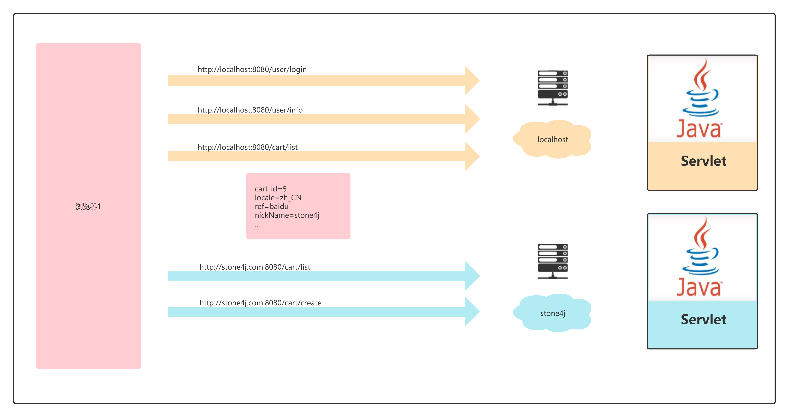

# 服务器技术Session

在服务器内存中存储了一些数据，每一个用户（客户端）都可以有这样的空间。也就是大家需要携带一些信息过来才能找到自己的空间


Session相当于每个用户存在服务器的保险柜，保险柜里可以存一些数据，这些数据也可以是**敏感数据**；要获得保险柜要带着钥匙，如果钥匙丢了，就打不开这个保险柜


## 提供Session

Session不需要专门去提供，当我们获取Session的时候，其实就提供了Session给客户端


当我们在服务端获取Session的时候，其实会提供一个响应头set-cookie

```http
HTTP/1.1 200
Set-Cookie: JSESSIONID=F1500D1D295B3953DCBBF89AD614F1E6; Path=/demo2; HttpOnly
Content-Length: 0
Date: Mon, 20 Feb 2023 06:55:17 GMT
Keep-Alive: timeout=20
Connection: keep-alive

```


JSESSIONID这样的一个key，其实就是保险柜的钥匙；我们下一次发起请求的时候，其实就会在Cookie中携带这个Cookie

第二次发起请求的请求头

```http
GET http://localhost:8080/demo2/hello HTTP/1.1
Host: localhost:8080
Connection: keep-alive
Cache-Control: max-age=0
sec-ch-ua: "Chromium";v="110", "Not A(Brand";v="24", "Microsoft Edge";v="110"
sec-ch-ua-mobile: ?0
sec-ch-ua-platform: "Windows"
Upgrade-Insecure-Requests: 1
User-Agent: Mozilla/5.0 (Windows NT 10.0; Win64; x64) AppleWebKit/537.36 (KHTML, like Gecko) Chrome/110.0.0.0 Safari/537.36 Edg/110.0.1587.46
Accept: text/html,application/xhtml+xml,application/xml;q=0.9,image/webp,image/apng,*/*;q=0.8,application/signed-exchange;v=b3;q=0.7
Sec-Fetch-Site: none
Sec-Fetch-Mode: navigate
Sec-Fetch-User: ?1
Sec-Fetch-Dest: document
Accept-Encoding: gzip, deflate, br
Accept-Language: zh-CN,zh;q=0.9,en;q=0.8,en-GB;q=0.7,en-US;q=0.6
Cookie: JSESSIONID=F1500D1D295B3953DCBBF89AD614F1E6

```


这个JSESSION这个Cookie的name对应的value就是Session对象的id，通过这个id对应的就是一个session对象


## 获取Session


获得Session可以使用Request提供的getSession方法

> **getSession()**
>
> - 如果还没有创建Session，那么就创建一个Session；如果已经有了Session，那么就返回这个Session。当前这个客户端或用户第一个调用getSession方法的时候创建了Session
>
> getSession(boolean create)
>
> - 如果create的值为true则同上；
> - 如果create的值为false，那么如果有了Session则返回Session对象，如果没有则返回null，就不会创建Session
>
> 实际上我们使用的无参方法更多一些

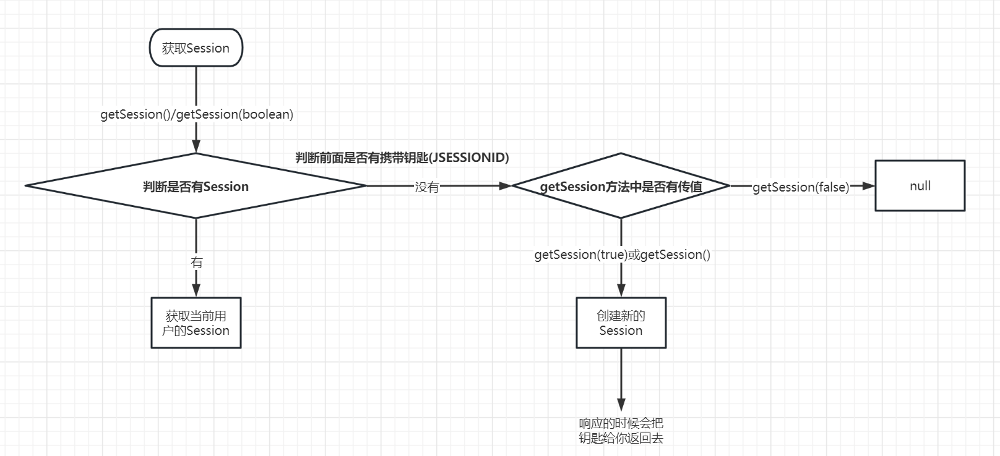

## 使用Session

在服务器端创建Session，它才能够获得Session

Session其实就像一个保险柜 → key-value形式的保险柜

key：String

value：Object


存：setAttribute(String,Object)

取：getAttribute(String)


```java
@WebServlet("/session/set")
public class SessionSetServlet extends HttpServlet {

    @Override
    protected void doGet(HttpServletRequest req, HttpServletResponse resp) throws ServletException, IOException {
        // 如果是第一次访问，那么做的事情就是创建并获取Session
        HttpSession session = req.getSession();
        session.setAttribute("mobile","18666778899");
        session.setAttribute("userid","65536");
    }
}
```

```java
@WebServlet("/session/get")
public class SessionGetServlet extends HttpServlet {

    @Override
    protected void doGet(HttpServletRequest req, HttpServletResponse resp) throws ServletException, IOException {
        // 如果是第一次访问，那么做的事情就是创建并获取Session
        HttpSession session = req.getSession();
        Object mobile = session.getAttribute("mobile");
        Object userid = session.getAttribute("userid");
        String result = userid + " : " + mobile;
        resp.getWriter().println(result);
    }
}
```


只要是同一个用户（客户端），即使是不同的Servlet，都是可以从Session中存取数据的；其中有一个关键点，如何识别为同一个用户，客户端发起请求携带的Cookie中的JSESSIONID对应的值相同


通常使用Session维护的是一些敏感数据，比如用户id或用户信息（user对象之类）

## Session的生命周期

对象生命周期：

对象的创建：request.getSession()

对象的销毁：关闭服务器、卸载应用


数据的生命周期

数据的产生：session域(空间)

数据的销毁：对象的销毁不会导致数据的销毁。数据的销毁只有 以下两种可能性：

1. session有效期到达（默认是30min）
2. 主动调用session.invalidate()方法-----用在注销的场景下。

## 常见问题

### 关闭浏览器，Session是否被销毁

并没有

只不过当前浏览器发起请求的时候，通常没有继续携带之前的JSESSIONID，但如果你仍然携带之前的JSESSIONID，那么仍然可以获取数据

### 服务器关闭，Session发生了什么

Session对象会被销毁，并且会被序列化。

当服务器重启时，会被反序列化，重新加载到内容。

当时要注意，重启前后的Session对象并不是同一个，但是JSESSIONID是同一个值


来写一个例子


### Session失效，原因会是啥

Session失效就是从Session中获取不到其存储的信息，则可以认为Session失效

- 跨域请求Session不能共享 → ip或端口号或域名发生变化，都叫跨域
  - 比如192.168.3.15:8080 前端 访问了 192.168.3.15:8083 → 端口号发生了变化，跨域

- 过期或手动设置
- 请求携带的JSESSIONID变了

### 禁用Cookie之后的session策略

session底层是依赖于cookie的，但是如果浏览器禁用了cookie，那么session还可以使用吗？还可以。但是必须采用一种URL重写的方式。此时session的编号会附着在地址栏的后面，以;形式来进行分割。

举个例子：http://localhost:8080/demo2/session/fetch;JSESSIONID=XXXX

## 思考

如果让你自定义一个类似于Session的技术，你能做出来吗？

>  如果要实现一个自定义的Session，需要做什么事情？
>
> 1. 能够获取自定义Session的方法，获取自定义Session的这个方法，也能够返回一把钥匙
> 2. 考虑数据存储的问题，我们应该创建一个什么样的结构的数据 Map<钥匙,自定义Session>
> 3. 自定义的Session应该是什么结构的数据，key为String，value为Object的键值对，Map\<String,Object>
>    1. setAttribute(String,Object)  →   map.put(String,Object)
>    2. getAtrribute(String)              →   map.get(String)
> 4. 过期时间，自定义Session中定义一个成员变量，就叫过期时间，当我们获取session(的信息)的时候，先检查当前时间和过期时间的关系；也可以增加让你的Session失效的方法，map里的信息清除

可以自己尝试来做一下？

后面做项目的时候会给大家一个参考

# 案例

重构登录案例，并且增加注销功能

我们 在前面Request和Response学习阶段实现的登录案例其实是有些瑕疵的，**前面案例我们在登录成功之后将用户信息存储在ServletContext中，这是不合理的**。我们应该在Session中存储用户信息，保证不同的用户获取的时候是自己Session中的信息，另外通过Session的invalidate方法实现注销功能

- session.setAttribute("username",username)
- session.invalidate()

```java
@WebServlet("/login")
public class LoginServlet extends HttpServlet {

    SqlSessionFactory sqlSessionFactory;

    @Override
    public void init() throws ServletException {
        sqlSessionFactory = (SqlSessionFactory) getServletContext().getAttribute(MyBatisUtil.SQL_SESSION_FACTORY);
    }

    @Override
    protected void doGet(HttpServletRequest request, HttpServletResponse response) throws ServletException, IOException {
        SqlSession sqlSession = sqlSessionFactory.openSession();
        UserMapper userMapper = sqlSession.getMapper(UserMapper.class);
        String username = request.getParameter("username");
        String password = request.getParameter("password");

        List<String> passwordFromDb = userMapper.selectPasswordByUsername(username);
        response.setContentType("text/html;charset=utf-8");
        if (passwordFromDb != null && passwordFromDb.size() == 1 && password.equals(passwordFromDb.get(0))) {
            response.getWriter().println("登录成功,即将查看个人信息");
            response.setHeader("refresh","2;url=/demo3/info");
            request.getSession().setAttribute("username", username);
        }else{
            response.getWriter().println("登录失败，即将跳转到登录页面重新登录");
            response.setHeader("refresh","2;url=/demo3/login.html");

        }
    }

    @Override
    protected void doPost(HttpServletRequest request, HttpServletResponse response) throws ServletException, IOException {
        this.doGet(request, response);
    }
}
```

```java
@WebServlet("/info")
public class InfoServlet extends HttpServlet {

    @Override
    protected void doGet(HttpServletRequest req, HttpServletResponse resp) throws ServletException, IOException {
        SqlSessionFactory sqlSessionFactory = (SqlSessionFactory) getServletContext().getAttribute(MyBatisUtil.SQL_SESSION_FACTORY);
        UserMapper userMapper = sqlSessionFactory.openSession().getMapper(UserMapper.class);
        String username = (String) req.getSession().getAttribute("username");
        List<CskaoyanUser> cskaoyanUsers = userMapper.selectUserByName(username);
        CskaoyanUser user = null;
        resp.setContentType("text/html;charset=utf-8");
        if (cskaoyanUsers != null && cskaoyanUsers.size() == 1) {
            user = cskaoyanUsers.get(0);
            resp.getWriter().println(user.toString());
        }else {
            resp.getWriter().println("获取数据有误，请重新登录");
            resp.setHeader("refresh","2;url=/demo3/login.html");
        }
    }
}
```

```java
@WebServlet("/logout")
public class LogoutServlet extends HttpServlet {
    private void doGet(HttpServletRequest request, HttpServletResponse response) throws IOException {
        response.setContentType("text/html;charset=utf-8");
        HttpSession session = request.getSession();
        session.invalidate();
        response.getWriter().println("注销成功，返回登录页面");
        response.setHeader("refresh", "2;url=" + request.getContextPath() + "/login.html");
    }
}
```


# 小结

## Cookie和Session

> 联系：Cookie和Session都是为了让服务端获取客户端提供的信息；提供的信息都是键值对形式的；Session技术是在Cookie技术的基础上进行的，都需要对请求头做处理

> 区别：
>
> - 信息位置
>   - Cookie是客户端技术，信息存储在客户端（浏览器），也意味着前端可以操作
>   - Session是服务器技术，信息储存在服务器
> - 敏感性
>   - Cookie共享的是常规信息，直接抓包获取的是对应的值
>   - Session通常共享的是敏感信息，直接抓包获取的是id
> - 值类型
>   - Cookie的值为String字符串
>   - Session的值为Object
> - 跨应用
>   - Cookie信息可以跨应用共享
>   - Session信息局限于当前应用

## 数据共享

Request域：存在转发关系的Servlet之间的数据共享，比如Servlet和JSP数据共享


Context域：整个应用之中的数据共享，比如整个应用中的SqlSessionFactory、properties等


Session域：同一个用户（客户端）中的数据共享，比如登录之后的用户信息

