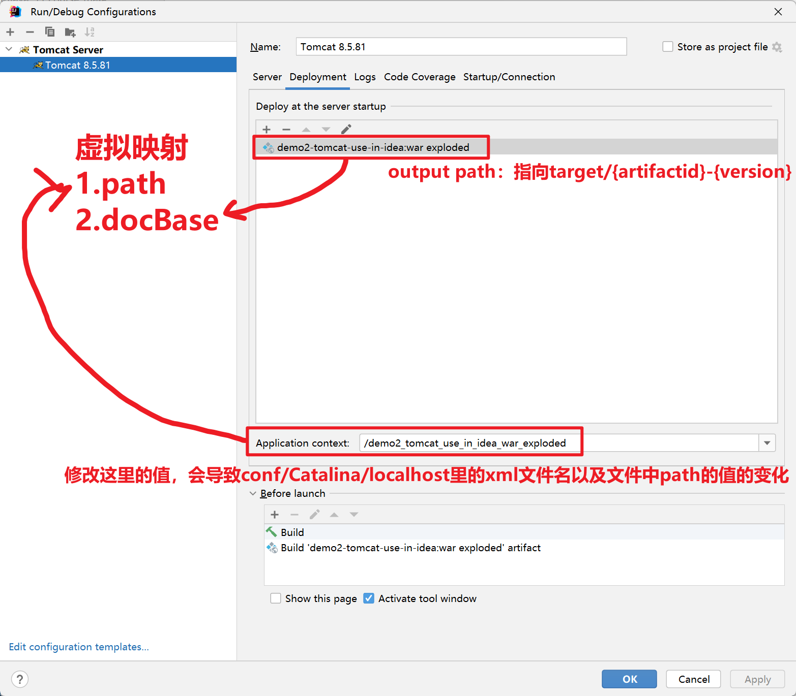

# 前言

## 学习目标

> 1. 掌握Tomcat的使用，以及IDEA中使用Tomcat应用的方式
> 2. 掌握Web应用的目录结构
>
>    - 标准目录结构（应用部署、编译）
>    - Maven开发的目录结构
>    - 使用IDEA来开发Web应用
> 3. 熟悉Servlet的执行流程和生命周期
>
>    - 掌握service方法
>    - 掌握init、destroy方法执行时机和次数
> 4. 熟悉Servlet使用和相关配置
> 5. 熟悉ServletContext的功能
> 6. 了解XML配置方式

## 前置知识准备

> - 面向对象编程（对象、类）
> - Tomcat的应用程序和启动、docBase配置 → 要在IDEA中直接使用Tomcat
> - 开发工具：Postman


# 介绍

## JavaEE介绍

JavaSE（Java Platform, Standard Edition）是Java平台的标准版，它提供了Java语言的核心库和运行环境，用于开发和部署独立的Java应用程序。JavaSE包含了Java的基本功能和特性，如面向对象编程、异常处理、集合框架、多线程、输入输出等。它是Java开发的基础，所有其他的Java技术都是建立在JavaSE之上的。

JavaEE（Java Platform, Enterprise Edition）是Java平台的企业版，它是建立在JavaSE之上的一组扩展和标准，专注于开发和部署企业级的分布式应用程序。**Web服务器。**JavaEE提供了一系列的API和规范，用于实现企业级应用所需的各种功能，如Web应用开发、数据库访问、消息传递、事务处理、安全性等。JavaEE还包括一些服务器端的技术和组件，如**Java Servlet**、JavaServer Pages（JSP）、Enterprise JavaBeans（EJB）、Java Message Service（JMS）等。

JavaSE和JavaEE可以看作是Java平台的两个不同的版本，它们的关系是JavaEE是建立在JavaSE之上的扩展和增强。JavaSE提供了Java语言的基本功能和库，而JavaEE在此基础上提供了更多面向企业级应用的功能和组件，用于开发大型、复杂的分布式系统。因此，如果你只是开发简单的独立应用程序，使用JavaSE就足够了；而如果你需要开发企业级的应用程序，特别是涉及到Web开发、事务处理等方面，那么JavaEE会更适合。


服务器：服务器硬件、服务器应用（软件）


B/S和C/S是指不同的客户端/服务器架构模型。

B/S代表浏览器/服务器（Browser/Server），它是一种网络应用程序的架构模型。在B/S模型中，用户通过浏览器作为客户端向服务器发送请求，服务器处理请求并返回响应。这种模型常见于Web应用程序，其中浏览器负责展示用户界面，而服务器处理逻辑和数据处理。

C/S代表客户端/服务器（Client/Server），这是另一种常见的架构模型。在C/S模型中，客户端和服务器之间有直接的通信，客户端发送请求给服务器，服务器处理请求并返回响应。这种模型通常用于桌面应用程序或本地网络环境中。


## Servlet介绍

Server Applet 缩写组成的，小程序，指的是运行在JavaEE容器（Tomcat）下的小程序

Servlet是一种Java编程语言的服务器端组件，它主要用于扩展Web服务器的功能。Servlet运行在服务器上，接收来自客户端（通常是Web浏览器）的请求并生成响应。它是Java企业版（Java Enterprise Edition，简称Java EE）的一部分，用于构建基于Web的应用程序。

Servlet通过Java编程语言编写，遵循Servlet API规范。它可以被部署到支持Servlet规范的Web容器（如Apache Tomcat、Jetty等）中运行。通过Servlet，开发人员可以处理HTTP请求、执行业务逻辑、访问数据库、生成动态内容并将响应发送回客户端。


> 思考：
>
>  我们开发为什么要定义规范？
>
> 有一个类叫Father，抽象类，它有3个儿子（子类） Son1、Son2、Son3 ，有一个方法叫play
>
> Son1 son1 = new Son1();
>
> Son2 son2 = new Son2();
>
> son1.play();
>
> son2.play();
>
> 变化一下写法
>
> Father son1 = new Son1();
>
> Father son2 = new Son2();
>
> son1.play();
>
> son2.play();
>
> 如果做了这样的事情
>
> Father son2 = new Son3();
>
> son2.play();

不同的子类对象调用抽象类中定义的方法，实现不同的业务


通过Tomcat可以访问`静态资源`和`动态资源`，静态资源就是我们前端学的内容，比如HTML、JS、CSS、xml、字体文件、图片等内容，而Servlet提供的是动态资源的访问


Servlet的开发其实就是Servlet中的service方法的开发 → Servlet的开发规范


我们接下来的需求：访问`http://localhost:8080/ee/user/login`,页面上出现 LOGIN SUCCESS


```java
import javax.servlet.GenericServlet;
import javax.servlet.ServletException;
import javax.servlet.ServletRequest;
import javax.servlet.ServletResponse;
import javax.servlet.annotation.WebServlet;
import java.io.IOException;

/**
 * @author stone
 * @date 2023/01/12 22:44
 */
@WebServlet("/user/login")
public class UserServlet extends GenericServlet {
    @Override
    public void service(ServletRequest servletRequest, ServletResponse servletResponse) throws ServletException, IOException {
        servletResponse.getWriter().write("LOGIN SUCCESS");
    }
}
```

# IDEA中开发Web应用

## pom.xml

```xml
<packaging>war</packaging>

<dependencies>
    <dependency>
        <groupId>javax.servlet</groupId>
        <artifactId>javax.servlet-api</artifactId>
        <version>3.1.0</version>
        <scope>provided</scope>
    </dependency>
</dependencies>
```

### 打包方式

packaging = war

> pom 父工程，提供子工程通用的内容，只有一个pom.xml，没有代码和文件
>
> war web应用，要满足web应用的目录结构，要放在JavaEE容器下运行
>
> jar 默认的打包方式，如果想要运行jar，里面要包含main方法

### scope作用域

默认的作用域是compile

`javax.servlet-api` 的作用域是**provided**，编译的时候需要，而打包、运行的时候都不需要

因为已经有了，Tomcat中已经有了这个依赖，在tomcat的lib目录中有一个jar包servlet-api.jar

<center></center>

如果硬是要打包进去，有可能会发生冲突，导致未知的错误


## Servlet开发(后面会单独重点讲解)

开发好的Servlet和资源文件 编译后（target/{artifactId}-{version}目录） 放入到Tomcat下的webapp目录里是可以访问的


## docBase 设置来访问资源


demo2.xml文件中的内容，指定docBase，其实访问的这个指定的这个路径下的资源

```xml
<?xml version="1.0" encoding="UTF-8"?>
<Context docBase="D:\WorkSpace\cskaoyan2023\02-备课\JavaEE\prepare_talk2\resources_new\codes\servlet2\demo1-first-servlet\target\demo1-first-servlet-1.0-SNAPSHOT"/>
```


## ★_IDEA中使用Tomcat


JavaEE阶段都会在IDEA中使用Tomcat

SpringMVC阶段也会在IDEA中使用Tomcat


> 需要大家做的事情
>
> - packaging=war
> - 增加Tomcat server 
> - 提供deployment的配置（docBase）
>   - artifact → war exploded
>   - application context → 路径



# ★★★_Servlet开发

## GenericServlet和HttpServlet

都可以使用 来进行Servlet的开发


通过继承，来实现其方法

> 1. GenericServlet 实现其抽象方法service
> 2. HttpServlet 重写doGet、doPost方法


这两种方式其实都是执行的是service方法，HttpServlet是GenericServlet的子类，只不过是HttpServlet里的service方法给你实现好了


它会根据你的请求方法不同，去执行HttpServlet中的不同方法

```java
public abstract class HttpServlet extends GenericServlet {
    protected void service(HttpServletRequest req, HttpServletResponse resp) throws ServletException, IOException {
        String method = req.getMethod();
        if (method.equals("GET")) {
            this.doGet(req, resp);
        }  else if (method.equals("POST")) {
            this.doPost(req, resp);
        }
    }
}
```


```java
/**
 * 继承GenericServlet
 *  实现其抽象方法service
 *  localhost:8080/demo1/servlet1
 *  控制台里打印hello servlet1
 * @author stone
 * @date 2023/02/02 17:29
 */
@WebServlet("/servlet1")
public class Servlet1 extends GenericServlet {
    @Override
    public void service(ServletRequest servletRequest, ServletResponse servletResponse) throws ServletException, IOException {
        System.out.println("hello servlet1");
    }
}

/**
 * 继承HttpServletServlet
 *  重写其doGet、doPost方法
 *  localhost:8080/demo1/servlet2
 *  控制台里打印hello servlet2
 * @author stone
 * @date 2023/02/02 17:29
 */
@WebServlet("/servlet2")
public class Servlet2 extends HttpServlet {
    @Override
    protected void doGet(HttpServletRequest req, HttpServletResponse resp) throws ServletException, IOException {
        // 接下来会使用浏览器方法，通过浏览器的地址栏发送的请求是GET请求
        System.out.println("hello servlet2");
    }

    @Override
    protected void doPost(HttpServletRequest req, HttpServletResponse resp) throws ServletException, IOException {
        // 自己写业务
    }
}
```

> 我们在上面的代码中需要做的就是继承GenericServlet或HttpServlet，然后通过不同的实现类来完成不同的业务处理，而我们处理业务的核心方法就是
>
> - doService
> - doGet/doPost

## @WebServlet注解

务必要记住value属性即可

```java
@Target({ElementType.TYPE}) // 该注解可以写在类上
@Retention(RetentionPolicy.RUNTIME) // 该注解运行时生效
@Documented
public @interface WebServlet {
    String name() default "";

    String[] value() default {}; // 该Servlet的路径，通过该路径可以访问到这个servlet的service或doGet、doPost方法

    String[] urlPatterns() default {}; // 和value属性的功能是一致的

    int loadOnStartup() default -1; // 默认值是负数；如果为负数的话，意味着放访问该servlet路径的时候，该Servlet才初始化；如果不为负数，则Tomcat启动的时候就初始化，并且会按照数字的顺序来初始化不同的Servlet 

    WebInitParam[] initParams() default {}; // 提供初始化参数，当前基本不用

    boolean asyncSupported() default false;

    String smallIcon() default "";

    String largeIcon() default "";

    String description() default "";

    String displayName() default "";
}
```

### value属性（或urlPatterns）

我们通常使用的是其value属性

功能上和urlPatterns其实是一样的，但是value属性有一个好处就是如果说该注解只使用了value属性的话，value= 可以省略不写

使用其@Value属性建立URL和Servlet之间的映射关系

### 一个Servlet可以对应多个URL-Pattern

一个URL-Pattern不能对应多个Servlet


@WebServlet注解的时候，value属性和url-pattern属性，接收的值的类型String[]

```java
@WebServlet({"/hello1","/hello2","/hello3"})
public class HelloServlet extends HttpServlet {
    @Override
    protected void doGet(HttpServletRequest req, HttpServletResponse resp) throws ServletException, IOException {
        System.out.println("hello servlet");
    }

    @Override
    protected void doPost(HttpServletRequest req, HttpServletResponse resp) throws ServletException, IOException {
        doGet(req, resp);
    }
}
```


## ★★★URL-Pattern

使用@WebServlet的value属性或url-pattern属性来维护，简历url-pattern和Servlet之间的映射关系

@WebServlet注解的value属性的用法

### 合法写法

> 1. /路径匹配
>
> 语法：/xxx或/xxx/*
>
> 注意事项：
>
> - 以/作为开头（不能省略开头的/），可以写多级的url
> - 可以使用通配符\*
>   - 举个例子/hello/\*, 这里的\*可以代表多级的任意URL；


> 2. /类型匹配
>
> 语法：*.xxx
>
> 注意事项：
>
> - \*.do、\*.action这样的一些写法，比如 hello.do就可以找到\*.do对应的Servlet来处理请求
> - 当前基本上不再使用
> - 比如一些特殊的资源，可以使用特殊的Servlet来处理，比如jpg、css等这些资源


> 3. 缺省匹配
>
> 语法：/
>
> 注意事项：非常特殊的写法

### 优先级

1.路径匹配 > 类型匹配

2.使用的是匹配度更高的Servlet，/abc/d ，存在两个Servlet，分别url-pattern是/abc/* 和/


通常是我们访问某一个请求，只有一个对应Servlet


### 缺省Servlet

提供了一个页面 hello.html，也提供一个servlet，这个Servlet映射的url-pattern也是hello.html


Tomcat会提供缺省的Servlet，本身是用来做静态资源访问的，如果你想要提供缺省的Servlet，可以做，将自定义的这个Servlet它的URL-Pattern设置为/ 即可，但是会导致原有的缺省Servlet失效


如果你没有提供，我给你提供一个默认的；如果你提供了，则以你提供的为准，后面SpringMVC就是在此基础上做了设计的


## Servlet的生命周期

LifeCycle

生命周期：在一些特定的时间会去执行一些方法，而时间通常指某个东西从初始化到结束在整个阶段中会遇到的一些时间点


这里我们讲的是Servlet的生命周期，指的是每一个Servlet的生命周期，每一个Servlet它的生命周期都需要单独去考虑


方法：后续去讲生命周期的时候，都会围绕着方法展开；话题都会是这个方法在什么时候执行，会执行多少次


| 方法名  | 时间                 | 次数 | 说明                                            |
| ------- | -------------------- | ---- | ----------------------------------------------- |
| init    | Servlet初始化        | 1    | 只执行一次，在service之前，用来用来做一些初始化 |
| service | 访问Servlet对应的URL | n    | 执行多次，用来处理业务                          |
| destroy | Servlet销毁          | 1    | 只执行一次，通常用来做资源的释放                |


Servlet是何时初始化的：前面讲@WebServlet注解的时候，有一个属性load-on-startup

- 默认值是负数；
- 如果为负数的话，意味着放访问该servlet路径的时候，该Servlet才初始化；
- 如果不为负数，则Tomcat启动的时候就初始化，并且会按照数字的顺序来初始化不同的Servlet 

Servlet是何时销毁的：

- Tomcat停的时候


增加几个Servlet

```java
@WebServlet(value = "/hello",loadOnStartup = -2)
public class HelloServlet extends HttpServlet {}

@WebServlet(value = "/first",loadOnStartup = 1)
public class FirstServlet extends HttpServlet {}

@WebServlet(value = "/second",loadOnStartup = 2)
public class SecondServlet extends HttpServlet {}
```

想要看到他们的init、service（doGet）、destroy


- 应用程序启动 → first init    、 second init
- 分别访问 （不分先后顺序）
  - /first   → first service
  - /second → second service  
  - /hello → hello init 、hello service
  - 再次访问/hello → hello service
- 应用程序关闭
  - destroy


# ServletConfig（了解）

键值对配置

- 放入配置
- 获取配置

要通过ServletConfig实例（对象）来进行操作，每一个Servlet都有与之对应的ServletConfig


## 放入配置

场景，将username=root这样的键值对放入到ServletConfig

```java
@WebServlet(value = "/hello",
        initParams = {@WebInitParam(name = "username",value = "root"),
                @WebInitParam(name = "password",value = "123456")})
public class HelloServlet extends HttpServlet {
}
```


在HelloServlet父类的父类GenericServlet中有一个成员变量config是ServletConfig类型的

而在init方法中有给这个成员变量做赋值


也就是这个成员变量在初始化阶段，已经获得了这些值


意味着在service方法（doGet、doPost）中，可以获得这个成员变量，并且从中获取值


## 取出配置

在Servlet中已经提供了一个方法getServletConfig方法，就是获得GenericServlet中的ServletConfig类型的成员变量config

```java
public ServletConfig getServletConfig() {
    return this.config;
}
```


子类中可以使用父类的方法，也就是在我们自行开发的Servlet中可以直接来来调用方法来获得

```java
@WebServlet(value = "/hello",
        initParams = {@WebInitParam(name = "username",value = "root"),
                @WebInitParam(name = "password",value = "123456")})
public class HelloServlet extends HttpServlet {
    @Override
    protected void doGet(HttpServletRequest req, HttpServletResponse resp) throws ServletException, IOException {
        ServletConfig servletConfig = getServletConfig();
        String username = servletConfig.getInitParameter("username");
        String password = servletConfig.getInitParameter("password");
        System.out.println(username + ":" + password);
    }
}
```

# ★ServletContext

**整个Web应用提供的共享空间，应用程序启动的时候会初始化，可以通过键值对的方式在存储和取出数据**

Servlet上下文，开发过程中使用ServletContext实例（对象），使用这个实例其实维护的也是键值对


前面的ServletConfig是每一个Servlet使用的单独的一个ServletConfig

而ServletContext是所有的Servlet共享的


在所有的Servlet中都可以通过方法直接获得ServletContext，并且获得的是同一个ServletContext，在ServletContext中提供的数据其实就是被所有的Servlet共享了


## 获得方式

> 1. 在Servlet中直接使用getServletContext()
> 2. 通过ServletConfig提供的getServletContext方法来获得


```java
@WebServlet("/hello")
public class HelloServlet extends HttpServlet {
    @Override
    protected void doGet(HttpServletRequest req, HttpServletResponse resp) throws ServletException, IOException {
        ServletContext servletContext1 = getServletContext();
        ServletContext servletContext2 = getServletConfig().getServletContext();
        System.out.println("servletContext1 = " + servletContext1);
        System.out.println("servletContext2 = " + servletContext2);
    }
}
```

```java
@WebServlet("/bye")
public class GoodbyeServlet extends HttpServlet {

    @Override
    protected void doGet(HttpServletRequest req, HttpServletResponse resp) throws ServletException, IOException {
        ServletContext servletContext = getServletContext();
        System.out.println("servletContext = " + servletContext);
    }
}
```


想要在所有的Servlet中共享数据

username=root

password=123456


```java
@WebServlet(value = "/parameter",loadOnStartup = 1)// 写正数，意味着应用程序启动的时候初始化，初始化会开始生命周期的init方法
public class ParameterServlet extends HttpServlet {

    @Override
    public void init() throws ServletException {
        ServletContext servletContext = getServletContext();
        servletContext.setAttribute("username","root");
        servletContext.setAttribute("password","123456");

    }
}
```


## 获得真实路径（了解）

```java
// 获得web资源的真实路径 → docBase里的真实路径
String realPath = servletContext1.getRealPath("");
System.out.println("realPath = " + realPath);

String realPath1 = servletContext1.getRealPath("hello.html");
System.out.println("realPath1 = " + realPath1);
```


# xml配置（了解项）

当前使用的是注解的方式来配置

```xml
<?xml version="1.0" encoding="UTF-8"?>
<web-app xmlns="http://xmlns.jcp.org/xml/ns/javaee"
         xmlns:xsi="http://www.w3.org/2001/XMLSchema-instance"
         xsi:schemaLocation="http://xmlns.jcp.org/xml/ns/javaee http://xmlns.jcp.org/xml/ns/javaee/web-app_4_0.xsd"
         version="4.0">
   
   <!--value属性（或url-pattern属性）：映射的url-pattern
   initParams属性：提供的初始化参数，可以通过ServletConfig来获得
   load-on-startup属性
    @WebServlet(value = "/HelloServlet",
    initParams = @WebInitParam(name = "username",value = "root"),
    loadOnStartup = 1)-->
    <servlet>
        <servlet-name>hello</servlet-name>
        <servlet-class>com.cskaoyan.service.HelloServlet</servlet-class>
        <init-param>
            <param-name>username</param-name>
            <param-value>root</param-value>
        </init-param>
        <load-on-startup>1</load-on-startup>
    </servlet>
    
    <servlet-mapping>
        <servlet-name>hello</servlet-name>
        <url-pattern>/HelloServlet</url-pattern>
    </servlet-mapping>
</web-app>
```

# 小结

Server处理请求的入口

@WebServlet的 value属性

ServletContext对象 → 伴随应用程序启动创建的一个全局共享的对象

# ★_Web应用和Maven工程

编译为Tomcat所支持的web应用


## Web应用的目录结构

> - Web应用的根目录（idea → target/artifactid-version → 配置tomcat做的虚拟映射的docBase）
>   - 可以直接访问的资源（主要是静态资源，比如html、js、css、图片等）
>   - WEB-INF文件夹 （受保护的资源的文件）
>     - classes文件夹（web应用的类加载路径classpath：字节码文件、配置文件）
>     - lib文件夹(第三方的依赖)
>     - web.xml(web应用的描述文件 → 基本上可以不使用了)
>     - 其他的文件（其他不想被直接访问的资源）


## Maven工程的目录结构

> - Maven工程的根目录
>   - src文件夹
>     - main文件夹（开发）
>       - java文件夹（java代码）
>       - resources文件夹（配置文件）
>       - webapp文件夹（web资源-对应的是web资源目录）
>         - WEB-INF
>     - test文件夹（测试）
>   - pom.xml文件
>   - target文件夹
>     - classes文件夹
>     - {artifactid}-{version}文件夹（tomcat虚拟映射的docBase）

## 对应关系图（核心）


非常重要：贯穿整个阶段


遇到一些问题：

- ClassNotFound：编译后的内容里没有这个类 → target/artifactid-version/WEB-INF/ 里的classes、lib目录
  - classes里没有 → src/main/java
  - lib里没有 → pom.xml
- FileNotFound → target/artifactid-version/

